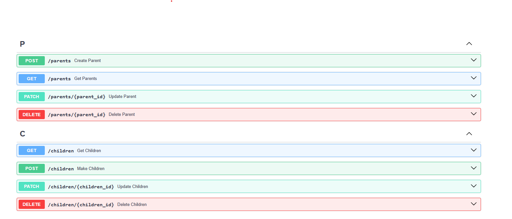

# UDSA

### User Data Storage Application

#### Description

This application is designed to store user data, including information such as first name, last name, and address (street, city, state, and zip). The application supports two types of users: Parent and Child. Parents can have a full address, while children cannot have an address and must belong to a parent. The application provides APIs to perform CRUD operations on user data, including deleting, creating, and updating user data.

#### Base URL

All endpoints are relative to the following base URL: [http://localhost:8000](http://localhost:8000)

#### API Documentation

This API follows the OpenAPI 3.1.0 specification. API Doc : [http://localhost:8000/doc](http://localhost:8000)

#### Features

- Supports two user types: Parent and Child
- Stores user data including first name, last name, and address
- Provides APIs for CRUD operations on user data
- Ensures that children are associated with a parent and cannot have an address

#### Technologies Used

- Language: Python (version 3.12)
- Database: SQLite (can be easily changed to other databases)
- Framework: FastAPI (for building APIs)
- Testing: Pytest (for testing the application)

#### Installation

1. Clone the repository from GitHub: `git clone https://github.com/shahidx0x/User-Data-Storage-Application.git`
2. Navigate to the project directory: `cd User-Data-Storage-Application`
3. Install the required dependencies: `pip install -r requirements.txt`

#### Running the Application

1. Ensure that you have Python installed on your system (version 3.12)
2. Navigate to the project directory
3. Run the application using the following command: `uvicorn main:app --reload`
4. The application will start running on `http://localhost:8000`

#### Testing

1. To run the tests, navigate to the project directory
2. Run the tests using the following command: `pytest`

#### Standards

- Code follows PEP 8 guidelines for Python
- Linting is performed using Flake8 and autopep8
- Testing is done using Pytest

## Endpoints

### Parents

#### Create Parent

- **Method**: POST
- **URL**: `/parents`
- **Summary**: Create a new parent.
- **Request Body**:
  - `ParentSchema`

#### Get Parents

- **Method**: GET
- **URL**: `/parents`
- **Summary**: Get a list of parents.
- **Query Parameters**:
  - `search` (optional): Search by parent's first name.
  - `page` (optional): Page number.
  - `limit` (optional): Number of items to display per page.

#### Update Parent

- **Method**: PATCH
- **URL**: `/parents/{parent_id}`
- **Summary**: Update an existing parent.
- **Path Parameters**:
  - `parent_id`: ID of the parent to update.
- **Request Body**:
  - `ParentUpdateSchema`

#### Delete Parent

- **Method**: DELETE
- **URL**: `/parents/{parent_id}`
- **Summary**: Delete an existing parent.
- **Path Parameters**:
  - `parent_id`: ID of the parent to delete.

### Children

#### Get Children

- **Method**: GET
- **URL**: `/children`
- **Summary**: Get a list of children.
- **Query Parameters**:
  - `search` (optional): Search by child's first name.
  - `page` (optional): Page number.
  - `limit` (optional): Number of items to display per page.

#### Make Children

- **Method**: POST
- **URL**: `/children`
- **Summary**: Create a new child.
- **Request Body**:
  - `ChildSchema`

#### Update Children

- **Method**: PATCH
- **URL**: `/children/{children_id}`
- **Summary**: Update an existing child.
- **Path Parameters**:
  - `children_id`: ID of the child to update.
- **Request Body**:
  - `ChildrenUpdateSchema`

#### Delete Children

- **Method**: DELETE
- **URL**: `/children/{children_id}`
- **Summary**: Delete an existing child.
- **Path Parameters**:
  - `children_id`: ID of the child to delete.

## Schemas

- `ParentSchema`
- `ParentUpdateSchema`
- `ChildSchema`
- `ChildrenUpdateSchema`
- `HTTPValidationError`
- `ValidationError`
